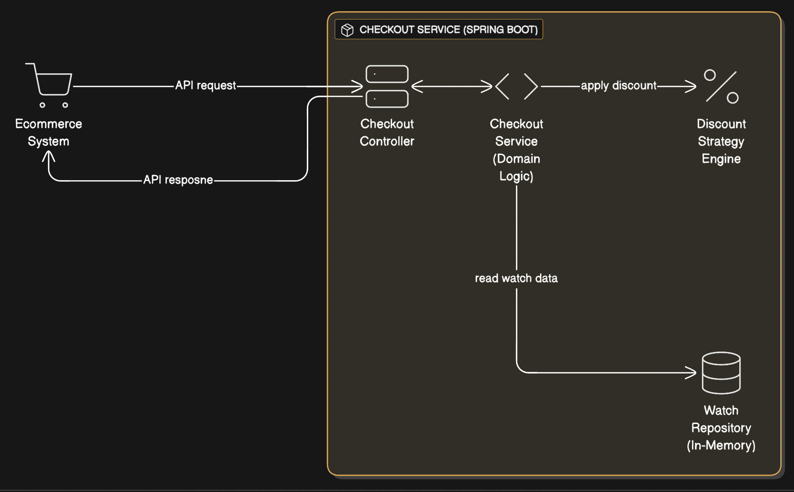

# E-Commerce Checkout Service

A Spring Boot REST API for a simplified e-commerce checkout for a shopping cart(watches). Designed to integrate seamlessly into a microservices architecture.

## 🚀 How to Set Up and Run

### Prerequisites
- **Java 21** (LTS)
- **Maven 3.9+**

### 1. Build & Run the Application
```bash
mvn clean spring-boot:run
```
The API will be available at `http://localhost:8080`

### 2. Run Tests
```bash
mvn clean eraserio-architecture-diagram-code
```

### 3. API Documentation (Swagger/OpenAPI)
Once the application is running, interactive API documentation is available at:
- **Swagger UI:** [http://localhost:8080/swagger-ui/index.html](http://localhost:8080/swagger-ui/index.html)
- **OpenAPI Spec:** [http://localhost:8080/v3/api-docs](http://localhost:8080/v3/api-docs)

---

## 🏗 Architecture & System Design Fit

This service is designed as the **Checkout Microservice** component within the larger E-Commerce System Architecture.

### Architecture Diagram


### Internal Logic Flow

**Request Processing:**
1. **Controller Layer** (`CheckoutController`)
    - Receives `POST /api/v1/checkout` with `CheckoutRequest` (userId, cartId, items)
    - Validates request using Jakarta Bean Validation (`@Valid`)

2. **Service Layer** (`CheckoutService`)
    - **Aggregates** duplicate items in the product list (e.g., merges multiple entries for same watchId)
    - Fetches watch catalogue details from `WatchCatalogueRepository` for each unique watchId
    - Calculates total based on quantity and selected discount strategy

3. **Discount Engine** (Strategy Pattern)
    - Parses discount rules using `DiscountRuleParser` (regex-based)
    - Selects appropriate strategy:
        - `BulkDiscountStrategy` → for rules like "3 for 200"
        - `NoDiscountStrategy` → for standard pricing

4. **Response Generation**
    - Creates `CheckoutResponse` with:
        - Generated `orderId` (UUID)
        - Order Status: `COMPLETED`
        - Total cost (sum of all subtotals)
    - Returns `200 OK` with JSON response
---

## 🔌 API Endpoints

### 1. Checkout
**Endpoint:** `POST /api/v1/checkout`

**Request:**
```json
{
  "userId": "user-123",
  "cartId": "cart-456",
  "products": [
    { "watchId": "001", "quantity": 3 },
    { "watchId": "002", "quantity": 1 },
    { "watchId": "004", "quantity": 1 }
  ]
}
```

**Response:**
```json
{
  "orderId": "550e8400-e29b-41d4-a716-446655440000",
  "status": "COMPLETED",
  "totalCost": 360,
  "items": [
    {
      "watchId": "001",
      "watchName": "Rolex",
      "quantity": 3,
      "subtotal": 200
    }
  ]
}
```
---

## 🛠 Technical Stack

- **Spring Boot 3.5.8**
- **Java 21 (LTS)**
- **SpringDoc OpenAPI 2.8.0**
- **H2 Database**
- **Strategy Pattern:** Extensible discount logic

---

## 💭 Reflections & Future Development

### What I Did Not Have Time to Implement

If given more time, I would implement:

#### 1. Idempotency
- **Implementation:** Require an `Idempotency-Key` header. Cache successful responses in Redis and return the cached response for retries with the same key
- **Why Important:** Essential for preventing duplicate orders/payments in real-world scenarios with network retries.

#### 2. Distributed Tracing (Observability)
- **Implementation:** Require an `X-Correlation-ID` header for request tracing
- **Why Important:** Debug complex issues in distributed systems by following a request's journey

#### 4. Advanced Discount Engine (Stacking Rules)
- **Current Limitation:** Strategy Pattern selects *one* discount rule per item
- **Future Need:** Support complex, stacking rules (e.g., "Flat 10% Off" + "Buy 3 for 200")
- **Solution:** Refactor to **Chain of Responsibility** or **Decorator Pattern** to apply multiple discounts in a pipeline

#### 5. Caching Layer
- **Current Limitation:** `CheckoutService` fetches WatchCatalogue on every request
- **Improvement:** Keep WatchCatalogue data in a cache mechanism eg : **Redis**
- **Why Important:** Improves performance and reduces database load

---

## 🧠 Design Decisions

### 1. Discount Strategy Model: Parsed Strings vs. Relational Tables
**Choice:** Stored discount rules as strings (e.g., `"3 for 200"`) parsed at runtime

**Why:**
- Enables rapid iteration of rule types (e.g., adding "Buy 1 Get 1") via code changes in `DiscountRuleParser`
- No database schema migrations required for new rule types
- Human-readable format in the database

**Limitation:**
- Validation happens at runtime (parsing) rather than at database constraint level
- Regex parsing can be fragile if rules are malformed(eg: if the string given as "three for two hundred parsing will fail")

### 2. Service-Layer Aggregation vs. Strict Validation
**Choice:** The `CheckoutService` accepts duplicate items in the request and aggregates them

Example: `[{ "watchId": "001", "qty": 1 }, { "watchId": "001", "qty": 2 }]` → aggregates to `[{ "watchId": "001", "qty": 3 }]`

**Why:**
- Clients don't need to merge items before sending requests
- Reduces client-side complexity

**Alternative:** A stricter API might reject duplicate keys with validation errors

### 3.`userId` & `cartId`
**Choice:** Explicitly included `userId` and `cartId` in the request

**Why:**
- Seamlessly integrate into a larger e-commerce ecosystem
- Link carts/orders to specific users
- For managing cart sessions.

### 4. Order ID & Payment Assumptions
**Choice:** The response generates an `orderId` immediately

**Assumption:** We assume the "Happy Path" where:
- Payment is done
- Inventory is reserved successfully

**Reality:** In a real system, this ID might be a `pendingOrderId` until confirmed by downstream Payment/Inventory services

### 5. Strategy Pattern vs. Conditional Logic
**Choice:** Used the **Strategy Pattern** for discount calculation instead of if/else statements

**Why:**
- Adheres to the Open/Closed Principle
- New discount types can be added as new classes without modifying `CheckoutService`
- Clean separation of concerns
---

## 🧪 Testing Strategy

#### Discount Strategy Component (Strict TDD)
- **Red-Green-Refactor Cycle:** Followed rigorously for the discount engine
- **Process:**
    1. Wrote failing tests first (`BulkDiscountStrategyTest`)
    2. Implemented minimal code to make tests pass
    3. Refactored for clean design
- **Git Commits:** Reflect the TDD workflow (test → implementation → refactor)

#### Other Components
- **Approach:** Wrote JUnit tests in parallel or after to implementation
- **Coverage:**
    - `CheckoutControllerIntegrationTest`: Full HTTP request lifecycle using `MockMvc`
    - `WatchCatalogueRepositoryTest`: Data layer verification
    - `DiscountRuleParserTest`: Regex parsing validation
    - `CheckoutServiceTest`: Service layer verification
    - `BulkDiscountStrategyTest` & `NoDiscountStrategyTest`: Discount logic verification
    - `WatchCatalogueMapperTest`: DTO-entity mapping tests
    - Parameterized tests for improving coverage and reducing boilerplate.
    - Swagger endpoint availability tests

### Test Categories
- **Unit Tests:** Core business logic (discount parsing logic, discount strategies,price calculation)
- **Integration Tests:** End-to-end API flows with Spring context
---

## 💡 Alternate Solution

For a more type safe approach, I would refactor the Discount Engine with:

### 1. Structured Database Schema
Replace the `discount_expression` string with a relational structure:
eg:
```sql
CREATE TABLE discount_rules (
    id UUID PRIMARY KEY,
    watch_catalogue_id VARCHAR(50) REFERENCES watch_catalogue(id),
    rule_type VARCHAR(20),  -- 'BULK', 'BOGO', 'SEASONAL'
    required_qty INT,      -- e.g., 3
    discount_price DECIMAL  -- e.g., 200.00
);
```
**Updated Service Logic:**

```java
private DiscountStrategy selectStrategy(WatchCatalogue watchCatalogue) {
    List<DiscountRuleEntity> rules = discountRuleRepository
            .findByWatchId(watchCatalogue.id());

    return rules.stream()
            .filter(rule -> rule.getRuleType() == RuleType.BULK)
            .findFirst()
            .map(rule -> new BulkDiscountStrategy(
                    rule.getRequiredQty(),
                    rule.getDiscountPrice()
            ))
            .orElse(new NoDiscountStrategy(watch.unitPrice()));
}
```

**Benefits:**
- Enforces data integrity at the database layer
- Enables complex queries.
- Type-safe validation
- No regex parsing errors
---
